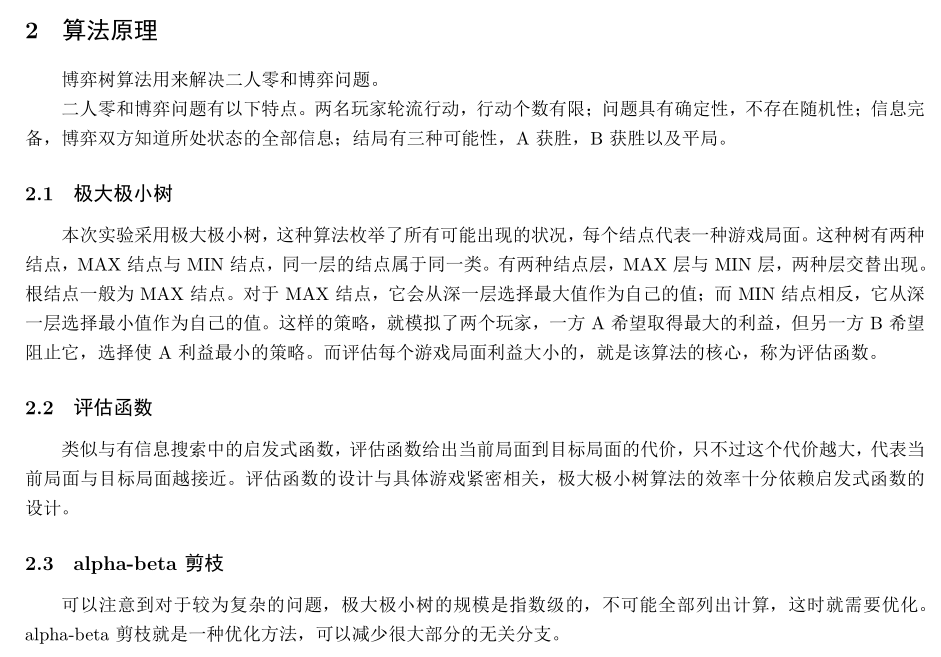
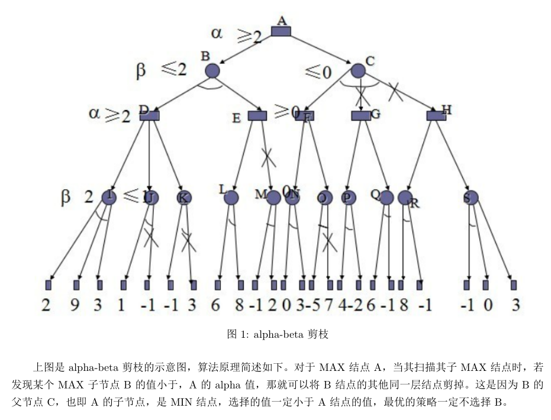
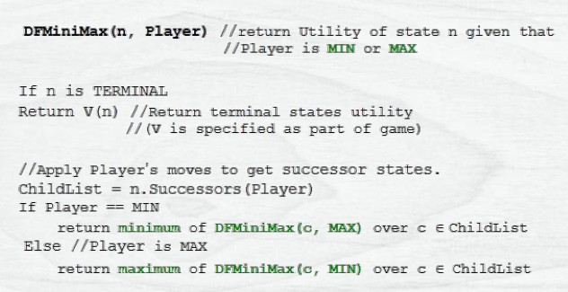
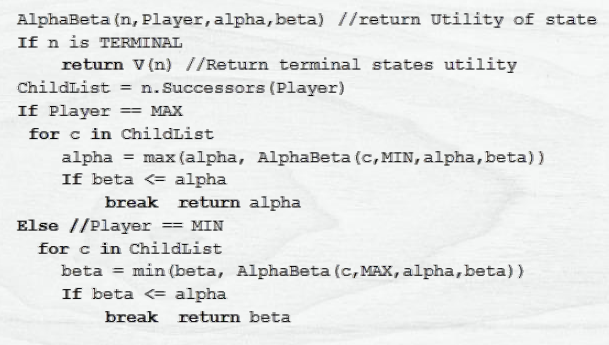

# 五子棋指导

欢迎大家进行五子棋项目，该项目C++代码700行左右，并且含有50%的重复代码。大致可以分为以下几个部分：

* 用户交互与界面部分：200行，实现输入的读入，棋盘的输出
* 游戏棋盘评估部分：100行*4，由于上下左右的四个方向。实现检测游戏是否结束、初始化、局面评估等功能
* 算法部分：150行，实现一棵博弈树以及剪枝

本项目会提供用户交互与界面部分。其余两个部分会结合个人的基础和完成情况放出。

### 算法解释（抄自实验报告，看不懂的地方先跳过，先完成基础任务~）

### 伪代码（抄自老师ppt）

博弈树算法：

alpha-beta剪枝算法：

### 基础任务

* 实现C++的类，学会调用类的成员和成员函数
* 掌握C++指针和vector的基础使用
* 实现C++中的树，学会树的构建、节点访问、回溯

#### 萌新朋友先看到这里就好

------

### 进阶任务

* 实现棋盘评估，能够对于一个局面给出预测的分数（分数越高代表优势越大）
* 实现博弈树，根据预测的分数建立一棵博弈树，然后可以根据博弈树选择最优下子处
* 实现剪枝，精简博弈树，从而实现更深层的搜索

### 更多优化

[如何设计一个还可以的五子棋AI | Jinlong's Blog (kimlongli.github.io)](https://kimlongli.github.io/2016/12/14/如何设计一个还可以的五子棋AI/)

### 代码说明

为了方便萌新朋友，所有代码我都放在同一个文件里，这并不是好的习惯，虽然小项目分不分文件也一样（逃

代码中我给出了完整的交互界面和部分棋盘评估方法，这是对于代码的一些说明：

* 博弈树的搜索范围，棋盘是11*11的，不可能每次对于所有点都进行模拟，所以只对于**两圈内包含棋子**的位置进行模拟，为此需要多维护一个available的二维数组
* 由于每次下一个子，只会影响到8个方向的棋型，这很有复用的价值。复用方式是对棋盘进行分解，分为每行、每列、每斜线的棋型。对这样的11个子组成的棋型（斜线上可能少于11个子）进行分数评估，存在两个分数，分别对应白方和黑方，使用$11*6*2$个数字就能存储棋盘的评估。最终这66个数字的和就是一个局面的一方的评估分数。（也可以使用132个数字，考虑进对方的优势）
* 原本评估函数我的实现也不是很好，只考虑了有限的棋型（不放出评估函数的真正原因x）期待大家可以使用字符串匹配实现更好的评估函数~

### 碎碎念

我的代码一直写得都不是很好，对项目有疑问一定要大家多多 ~==沟通==~/^==沟通==^\~==沟通==~（看我都搭好了沟通的桥梁，显示不正常的话打开preference偏好设置的所有拓展语法）